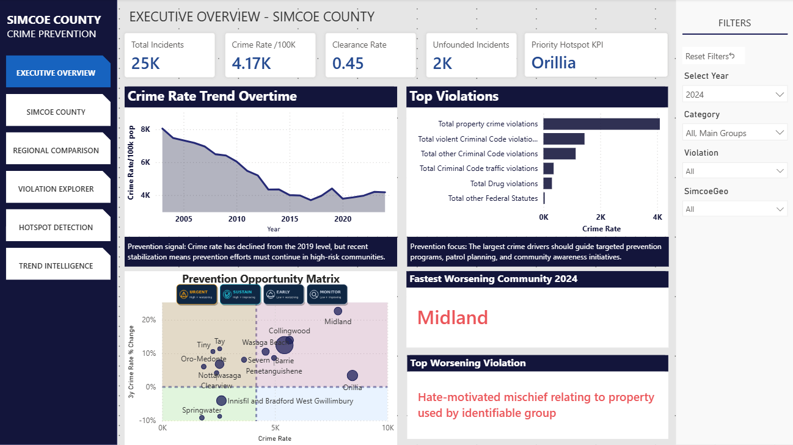
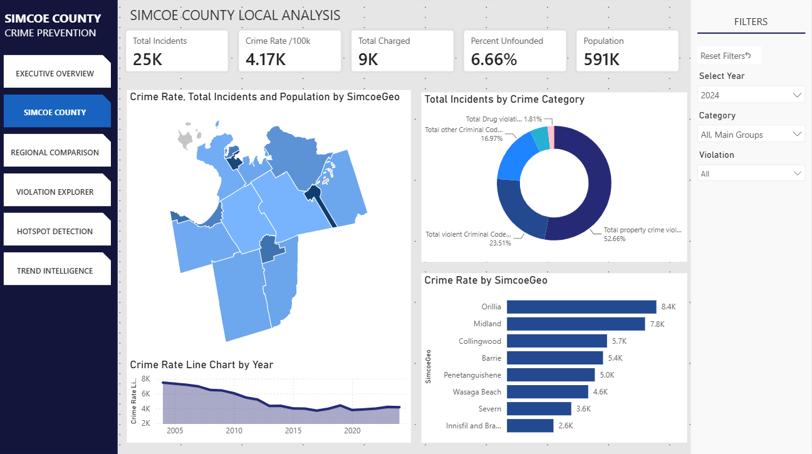
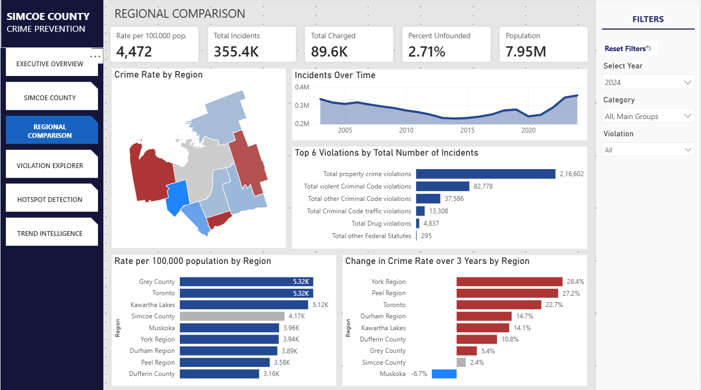
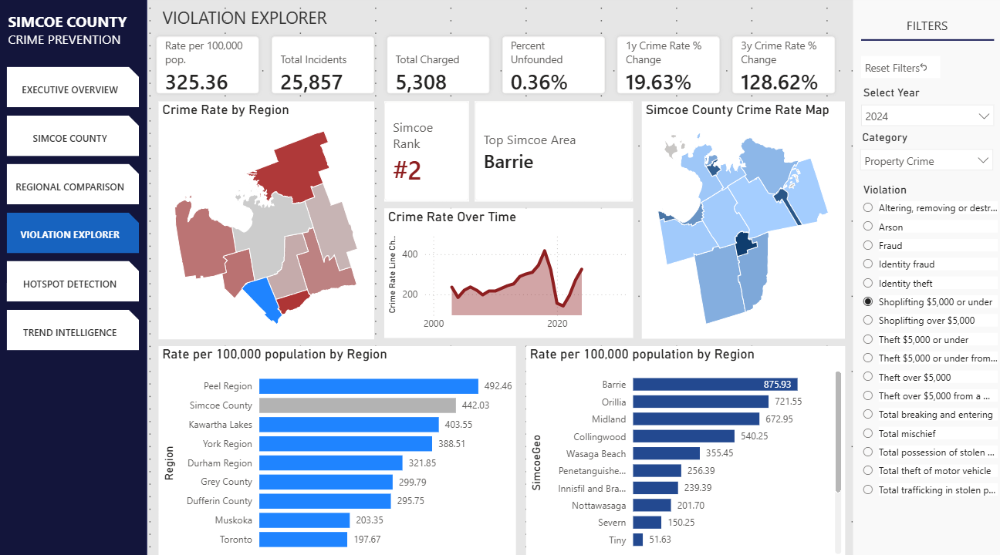
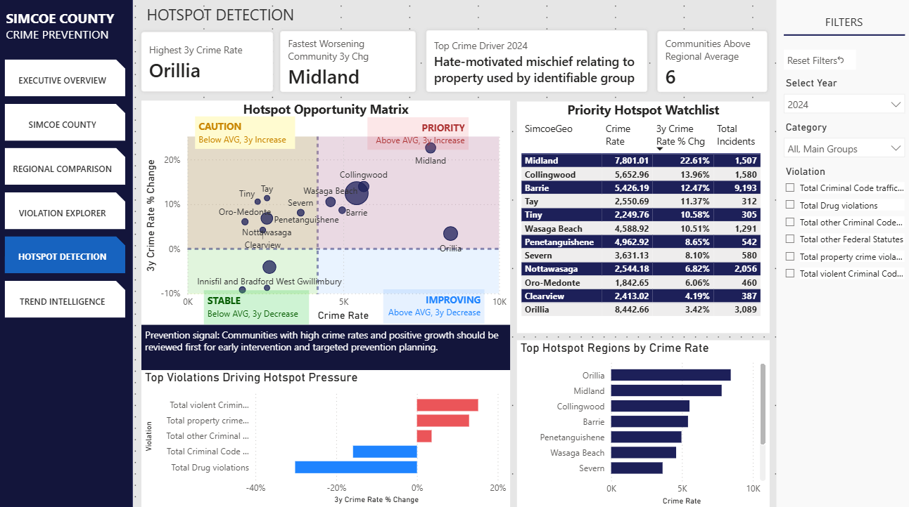
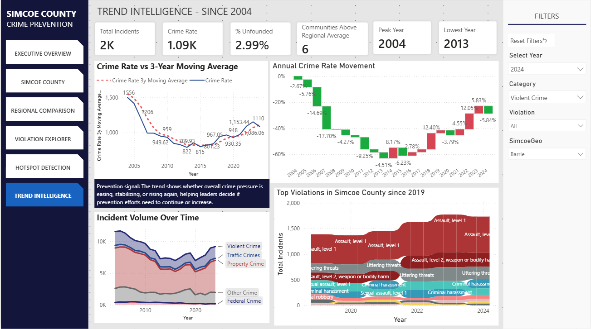
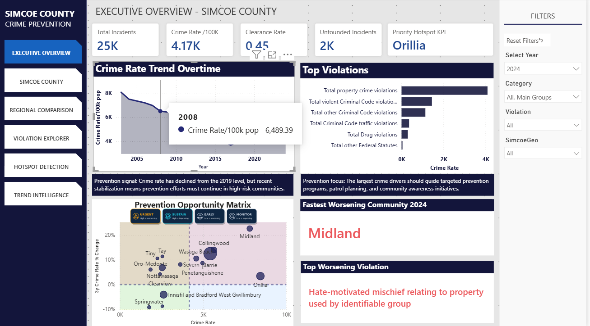

# Ontario Crime Prevention Analysis

*Interactive Power BI analysis of historical crime patterns, regional differences, community hotspots, and long-term trends across Simcoe County and selected Ontario regions.*



> **Portfolio case study:** Interactive analysis built from official Statistics Canada public data. Values shown in screenshots depend on the selected year and filters; they are not fixed benchmarks.

## Project overview

Ontario Crime Prevention Analysis is an interactive Power BI project designed to explore historical police-reported crime patterns and support evidence-based crime-prevention planning. It analyzes Statistics Canada data across Ontario police-service jurisdictions, with a primary focus on Simcoe County.

The dashboard examines how crime rates, incident volumes, violation categories, clearance-related indicators, and long-term trends vary across communities and over time. Regional comparisons benchmark Simcoe County against selected Ontario regions and broader provincial measures, providing context for local results.

Power BI, Power Query, DAX, data modelling, and GIS-based visualization transform the historical data into an interactive decision-support experience spanning executive KPIs, community analysis, violation drill-down, hotspot detection, three-year change, moving-average trends, rankings, filters, and tooltips.

## Business and analytical questions

- Where is recorded crime pressure highest after accounting for population?
- Which communities show worsening or improving multi-year trends?
- Which crime categories contribute most strongly to current conditions?
- How does Simcoe County compare with selected Ontario regions?
- How have crime patterns and incident volumes changed over time?
- Which communities may merit closer contextual review for prevention planning?

## Dashboard tour

### Executive Overview

The Executive Overview brings together headline KPIs, the overall crime-rate trend, major violation categories, hotspot signals, and prevention-oriented indicators in a single decision-support view. It answers: **What deserves attention first under the current filter context?** Metrics respond to the selected year, category, violation, and geography.

### Simcoe County Local Analysis



This page brings the analysis down to communities within Simcoe County through GIS mapping, local crime-rate comparisons, category composition, community ranking, and historical movement. It answers: **Where do spatial and community-level differences appear within Simcoe County?** Geographic visualization makes local variation easier to recognize without treating a rate alone as an explanation of community safety.

### Regional Comparison



Regional benchmarks place Simcoe County alongside selected Ontario regions using population-normalized rates, incident totals, long-term movement, leading violation categories, and three-year change. It answers: **How does Simcoe County compare with broader regional conditions?** This context avoids interpreting local figures in isolation.

### Violation Explorer



The drill-down page supports category and individual-violation selection, rate-per-100,000 normalization, dynamic rankings, regional comparison, Simcoe community comparison, and trend analysis. It answers: **How is a selected offence distributed across place and time?** Slicers update the KPIs, maps, rankings, and time series together.

### Hotspot Detection



The hotspot view combines crime rate, three-year change, and incident volume in a community watchlist and four-quadrant opportunity matrix. It answers: **Which areas combine elevated pressure with a direction of travel that may justify closer review?** These are analytical prioritization signals, not definitive judgments about community safety.

| Signal | Plain-language interpretation |
|---|---|
| Priority | Higher relative crime rate and an increasing three-year trend |
| Caution | Lower relative crime rate and an increasing three-year trend |
| Stable | Lower relative crime rate and a decreasing three-year trend |
| Improving | Higher relative crime rate and a decreasing three-year trend |

### Trend Intelligence



This page compares the crime rate with its three-year moving average, annual rate movement, incident volumes, crime-category evolution, and peak and low periods. It answers: **Is crime pressure rising, easing, or stabilizing over the longer term?** Moving averages reduce short-term noise so sustained direction is easier to interpret.

### Interactive Power BI Experience



The report uses slicers, cross-filtering, hover tooltips, year and category selection, violation drill-down, and geographic filtering. This image demonstrates a hover tooltip exposing the exact historical crime-rate value for a selected year.

## Analytical approach

```text
Open/public crime data → Data preparation → Power BI data model → DAX measures
→ GIS analysis → KPI and trend analysis → Hotspot framework → Interactive dashboard
```

- **Data preparation:** Power Query was used in the Power BI workflow; the extracted package does not expose enough query text to document individual transformations safely.
- **Data modelling:** The embedded semantic model supports time, geography, violation, incident, rate, and population context.
- **DAX:** Repository evidence includes measures for regional rate per 100,000, population, clearance, unfounded incidents, latest-year KPIs, dynamic rankings, crime drivers, community rate change, and tooltips.
- **Geographic analysis:** Map views compare selected Ontario regions and communities within Simcoe County.
- **Trend and hotspot analysis:** Rate movement, rolling three-year context, rankings, and the four-quadrant framework turn historical measures into interpretable signals.
- **Interaction design:** Shared slicers and visual interactions connect executive, offence, region, and community detail.

## Key analytical features

- Population-normalized crime-rate metrics
- Year-over-year and multi-year change analysis
- Three-year trend context and moving averages
- Local and regional geographic benchmarking
- Crime-category and individual-violation drill-down
- Dynamic KPIs, rankings, and watchlists
- Interactive filtering, cross-filtering, and tooltips
- GIS maps and prevention-oriented analytical storytelling

## Data Sources

This project uses publicly available police-reported crime data from Statistics Canada.

### Statistics Canada Table 35-10-0180-01

**Incident-based crime statistics, by detailed violations, police services in Ontario**

Used for detailed Ontario police-service and community-level analysis. [View the Statistics Canada source](https://www150.statcan.gc.ca/n1/en/catalogue/35100180).

### Statistics Canada Table 35-10-0177-01

**Incident-based crime statistics, by detailed violations, Canada, provinces, territories, Census Metropolitan Areas and Canadian Forces Military Police**

Used for broader provincial and regional benchmarking. [View the Statistics Canada source](https://www150.statcan.gc.ca/t1/tbl1/en/tv.action?pid=3510017701).

The completed dashboard focuses on the 1998–2024 historical period used for the project. Statistics Canada source tables may subsequently contain newer annual observations.

### Responsible use

These historical police-reported statistics should be interpreted within geographic, demographic, reporting, and policy context. A higher recorded crime rate alone does not explain why crime occurs or determine whether a community is safe or unsafe.

Hotspot and trend indicators are analytical prioritization signals for exploratory analysis and evidence-based planning. The dashboard does not automate policing or enforcement decisions and should not replace local knowledge or further investigation.

## Technology stack

| Technology | Purpose |
|---|---|
| Microsoft Power BI | Interactive reporting, modelling, and visual analytics |
| DAX | Normalized measures, dynamic KPIs, rankings, and contextual calculations |
| Power Query | Data preparation in the original Power BI workflow |
| GIS / geographic mapping | Spatial comparison across regions and communities |
| Data modelling | Semantic relationships and reusable measures |
| VS Code | Inspection and management of the extracted PBIX repository |
| Git / GitHub | Version control, repository hygiene, and portfolio publication |
| OpenAI Codex | AI-assisted repository audit, validation, documentation, and portfolio preparation |

## Development and repository workflow

The analytical dashboard was developed in Power BI, while VS Code was used to inspect and manage the extracted PBIX repository for version control, documentation, and publication readiness. Codex assisted with repository auditing, validation, and documentation without changing the report's analytical logic or generated definitions.

## Repository structure

This repository contains an extracted PBIX package rather than a conventional application:

```text
.
├── README.md
├── docs/
│   ├── images/
│   └── REPOSITORY_AUDIT.md
├── DAXQueries/
├── Report/
│   ├── definition/
│   └── StaticResources/
├── Connections
├── DataModel
├── DiagramLayout
├── Metadata
├── SecurityBindings
├── Settings
├── Version
├── [Content_Types].xml
├── .gitignore
└── requirements.txt
```

> **The Power BI package hierarchy is intentionally preserved. Files under the extracted report structure should not be arbitrarily moved or renamed because they form part of the Power BI artifact.**

The root `requirements.txt` documents that this project has no Python runtime dependencies; it does not make this a Python application.

## Repository audit and publication safety

The [repository audit](docs/REPOSITORY_AUDIT.md) documents publication-readiness checks. In summary:

- The Power BI hierarchy and generated report definitions remain unchanged.
- No known credentials or API keys were detected in text-searchable content, and report JSON validation passed.
- The embedded binary `DataModel` still requires licensing, sensitivity, and redistribution review before publication.

## Skills demonstrated

`Power BI` · `DAX` · `Power Query` · `Data Modelling`

`Business Intelligence` · `Data Analysis` · `Data Visualization` · `GIS Analysis`

`KPI Development` · `Trend Analysis` · `Regional Benchmarking` · `Hotspot Analysis`

`Interactive Dashboard Design` · `Data Storytelling` · `VS Code` · `Git` · `GitHub`

## Project context

This Ontario crime-prevention analytics project was completed as an academic capstone focused on evidence-based historical analysis. It is not an official Government of Ontario system, a deployed policing application, or evidence of government endorsement. VS Code and Codex were used as part of the repository engineering and documentation workflow while preserving the original Power BI report logic.
